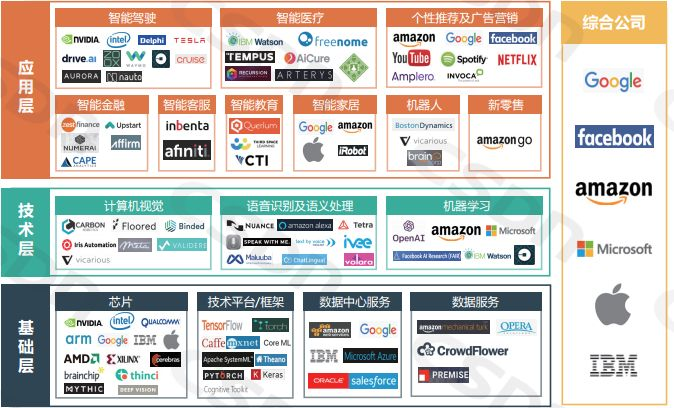

可以将人工智能产业划分为三层，分别是**基础层、技术层和应用层**

## 基础层

其中**基础层**是推动人工智能发展的基石，主要包括**数据、芯片和算法**三个方面.

三方数据提供商，国内以海天瑞声为代表，美国则以CrowdFlower为代表。

## 技术层

**技术层主要分为三个领域：机器学习、语音识别和自然语言处理、以及计算机视觉。**

### 机器学习

### 语音识别和自然语言处理

### 计算机视觉

其中除了BAT等大玩家之外，语音识别和自然语言处理领域的代表公司有科大讯飞、云知声、思必驰等，计算机视觉领域的代表公司有商汤科技、旷视科技、依图科技等。

## 应用层

**在AI应用领域，中国呈现出爆发的趋势，目前主要集中在安防、金融、医疗、教育、零售、机器人以及智能驾驶等领域。**其中安防领域的代表公司有海康威视、大华等；金融领域有蚂蚁金服、众安科技等；医疗领域有医渡云、汇医慧影等；教育领域有科大讯飞、乂学教育等；零售领域有阿里、京东、缤果盒子等；机器人领域有大疆创新、优必选等；智能驾驶领域有百度、驭势等。

