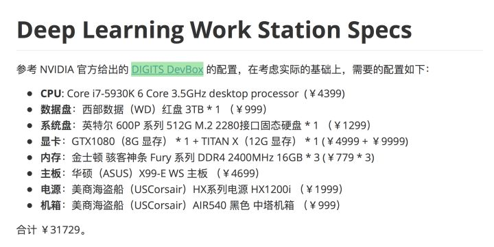

[深度学习硬件配置](https://www.zhihu.com/question/41822823/answer/152789767)

最佳 GPU 选择：Titan Xp

高效但昂贵：GTX 1080 Ti, GTX 1070, GTX 1080

高效且便宜：GTX 1060 (6GB)

要是处理的数据集在 250 GB 以上，那么你的选择最好是 GTX Titan X (Maxwell)、 NVIDIA Titan X Pascal 或 NVIDIA Titan Xp

要是资金不足，那就选择 GTX 1060 (6GB)