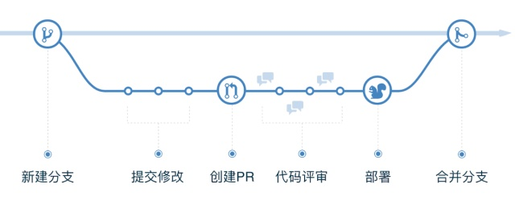

工作流就是“一类能够完全或者部分自动执行的经营过程，

它根据一系列过程规则、文档、信息或任务能够在不同的执行者之间进行传递与执行”。

如果数据没有流动，就没有工作流。比如遛狗、去杂货店和取干洗衣物等，这都不是工作流，而是任务管理。

## [真正的敏捷*工作流* —— GitHub flow](https://zhuanlan.zhihu.com/p/81396787)

### GitHub flow 是什么？

GitHub flow，顾名思义，就是 GitHub 所推崇的 Workflow。*千万不要理解成 GitHub 上才能用的 Workflow。*

**合并前集成（Integration before Merge）**

能够得知每个改动中每个文件的覆盖率情况，从而在开发过程中主动避免覆盖率下滑，把质疑集中到问题的来源 —— 提交代码并且覆盖率不足的人身上。

## links

[https://www.zhihu.com/search?type=content&q=%E5%B7%A5%E4%BD%9C%E6%B5%81](https://www.zhihu.com/search?type=content&q=工作流)

