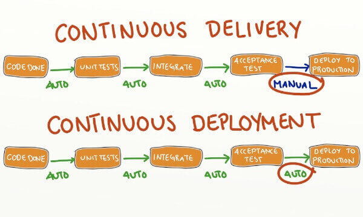

随着极限编程（Extreme programming）方法论的提出，持续集成（Continuous integration）也随之成为一项标准化的敏捷实践，

互联网软件的开发和发布，已经形成了一套标准流程，最重要的组成部分就是持续集成（Continuous integration，简称CI）。

- **持续集成指的是，频繁地（一天多次）将代码集成到主干。**

- **持续集成的目的，就是让产品可以快速迭代，同时还能保持高质量。**

- 它的核心措施是，代码集成到主干之前，必须通过自动化测试。只要有一个测试用例失败，就不能集成。

## 二、持续交付

**持续交付（Continuous delivery）指的是，频繁地将软件的新版本，交付给质量团队或者用户，以供评审。**

它强调的是，不管怎么更新，软件是随时随地可以交付的。

## 三、持续部署

**持续部署（continuous deployment）是持续交付的下一步，指的是代码通过评审以后，自动部署到生产环境。**

持续部署的目标是，代码在任何时刻都是可部署的，可以进入生产阶段。

## 四、流程

### 4.1 提交

### 4.2 测试（第一轮）

自动化测试。

第一轮至少要跑单元测试。

### 4.3 构建

所谓构建，指的是将源码转换为可以运行的实际代码，比如安装依赖，配置各种资源（样式表、JS脚本、图片）等等。

### 4.4 测试（第二轮）

### 4.5 部署

部署工具

### 4.6 回滚

## links

持续集成是什么？

http://www.ruanyifeng.com/blog/2015/09/continuous-integration.html

